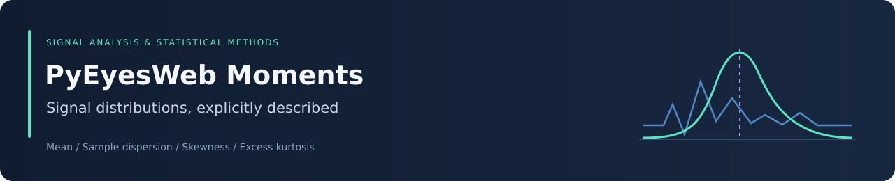
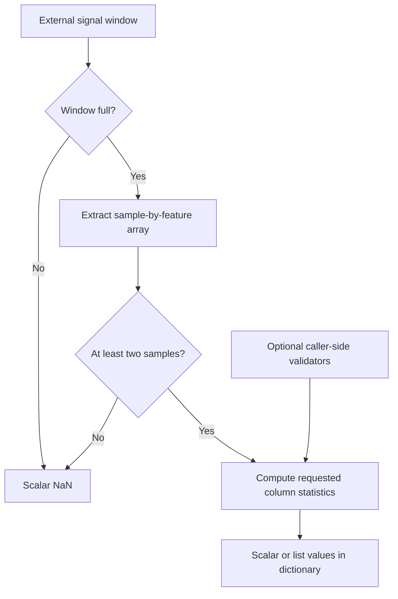

<div align="center">



# PyEyesWeb Statistical Moment Analyzer

### Column-wise signal descriptors with explicit statistical conventions


[Overview](#overview) · [Methods](#statistical-methods) · [Setup](#setup-and-integration) · [API](#analyzer-api) · [Validators](#validation-utilities) · [Verification](#verification-status)

</div>

## Overview

This repository provides a compact statistical-analysis component and parameter-validation utilities for integration with PyEyesWeb. The analyzer computes mean, sample standard deviation, skewness, and excess kurtosis independently for each signal column in a full sliding window.

The component can supply features to sensor, movement, and time-series workflows. It does not ingest a live sensor stream, manage the window buffer, classify activities, detect anomalies, or produce clinical interpretations by itself.

| Component | Responsibility |
|---|---|
| [statistical_moment.py](statistical_moment.py) | Selected statistical descriptors for a full signal window |
| [validators.py](validators.py) | Parameter type, bound, list, and filter-tuple checks |
| [Test Files](Test%20Files) | Existing demonstration and test scripts with differing API assumptions |
| External PyEyesWeb | Sliding-window implementation and shared filter-frequency validation |

**Repository scope:** the source modules live at the repository root. The `pyeyesweb` package hierarchy, `SlidingWindow` implementation, packaging metadata, and dependency lockfile are not included here.

## Architecture



The analyzer calls `is_full()` and `to_array()` on the supplied window. It takes the first item from `to_array()`; the second item, such as timestamps, is ignored. Validators are available to callers but are not automatically invoked by the analyzer.

## Statistical methods

Let $x_{ij}$ be sample $i$ in feature column $j$, with $n$ samples. Define the column mean and empirical central moments as

$$
\bar{x}_j = \frac{1}{n}\sum_{i=1}^{n}x_{ij},
\qquad
m_{r,j} = \frac{1}{n}\sum_{i=1}^{n}(x_{ij}-\bar{x}_j)^r.
$$

| Requested method | Response key | Definition | Implementation convention |
|---|---|---|---|
| `mean` | `mean` | $\bar{x}_j$ | NumPy arithmetic mean |
| `std_dev` | `std` | $\sqrt{\frac{1}{n-1}\sum_i(x_{ij}-\bar{x}_j)^2}$ | Sample standard deviation, `ddof=1` |
| `skewness` | `skewness` | $m_{3,j}/m_{2,j}^{3/2}$ | SciPy default moment estimator, `bias=True` |
| `kurtosis` | `kurtosis` | $m_{4,j}/m_{2,j}^{2}-3$ | SciPy Fisher excess kurtosis, `fisher=True, bias=True` |

Only requested methods are computed. Every operation uses `axis=0`, preserving the input feature-column order.

### Interpretation

Mean describes level; standard deviation describes dispersion in the original signal units. Skewness and excess kurtosis are dimensionless. Positive skewness indicates right-sided asymmetry. Excess kurtosis characterizes standardized fourth-moment behavior relative to a Gaussian population baseline of zero.

A finite Gaussian sample need not have exactly zero skewness or excess kurtosis. The current skewness and kurtosis calls use biased finite-sample estimators; the sample-standard-deviation convention does not make all four estimators bias-corrected.

These summaries discard temporal ordering within a window. Signals with the same value distribution can have different temporal dynamics; combine moments with appropriate temporal or spectral features when the application requires them.

## Setup and integration

### Clone and prepare an environment

Python 3.10 or newer is a practical starting point, subject to the requirements of your PyEyesWeb version. This repository does not declare a tested Python-version matrix.

```bash
git clone https://github.com/Foysal-A-Al/PyEyesWeb_Statistical-Moment-Analyzer.git
cd PyEyesWeb_Statistical-Moment-Analyzer
python -m venv .venv
```

| Platform | Activate the environment |
|---|---|
| Windows PowerShell | `.venv\Scripts\Activate.ps1` |
| Linux / macOS | `source .venv/bin/activate` |

```bash
python -m pip install numpy scipy
```

### Supply the upstream modules

Before importing `statistical_moment.py`, install or expose a compatible PyEyesWeb checkout in the same environment. This import must succeed:

```python
from pyeyesweb.data_models.sliding_window import SlidingWindow
```

The analyzer imports that class at module load time even when you supply a window-like adapter. NumPy and SciPy alone are therefore insufficient to import the analyzer.

For the filter-normalization helper, this additional upstream import must succeed:

```python
from pyeyesweb.utils.signal_processing import validate_filter_params
```

The latter import is deferred until `validate_and_normalize_filter_params` is called with a non-`None` argument. Other functions in `validators.py` can be used without PyEyesWeb.

There is no installation command such as `pip install .` for this checkout because it has no `pyproject.toml` or `setup.py`. From the repository root, use `from statistical_moment import StatisticalMoment` and `from validators import ...`. Package-qualified imports apply only after integrating the files into an upstream package.

## Quick example

After satisfying the upstream import above, this example exercises the analyzer without assuming a particular `SlidingWindow` constructor or append API:

```python
import numpy as np
from statistical_moment import StatisticalMoment

class FullWindow:
    """Example adapter; not a replacement streaming buffer."""

    def __init__(self, data):
        self.data = np.asarray(data, dtype=float)

    def is_full(self):
        return True

    def to_array(self):
        return self.data, None

window = FullWindow([
    [1, 10],
    [2, 20],
    [3, 30],
    [4, 40],
    [5, 50],
])

result = StatisticalMoment()(
    window,
    methods=["mean", "std_dev", "skewness", "kurtosis"],
)
print(result)
```

Expected values, rounded for presentation:

```python
{
    "mean": [3.0, 30.0],
    "std": [1.581139, 15.811388],
    "skewness": [0.0, 0.0],
    "kurtosis": [-1.3, -1.3],
}
```

For a single-column array, each value is a Python `float` rather than a one-element list. Keep data two-dimensional: univariate input should have shape `(n_samples, 1)`.

## Analyzer API

```python
analyzer = StatisticalMoment()
result = analyzer.compute_statistics(signals, methods)
result = analyzer(sliding_window, methods)
```

The callable form delegates to `compute_statistics`. The constructor has no configurable parameters; supply the method list on each call.

| Contract | Actual behavior |
|---|---|
| Window input | Object exposing `is_full()` and `to_array()` |
| Array input inside the window | Numeric two-dimensional array, samples × features |
| Ready window with at least two samples | Dictionary of requested statistics |
| Non-full window or fewer than two samples | Scalar `np.nan` |
| One feature | Scalar float per statistic |
| Multiple features | List per statistic in column order |
| Unknown method | Silently skipped |
| Empty method list | Empty dictionary for a ready, sufficiently populated window |

Although the source annotates the return as `dict`, the runtime contract also includes a scalar `NaN`. Handle readiness explicitly:

```python
result = analyzer(window, methods=["mean", "std_dev"])

if isinstance(result, dict):
    # Consume result["mean"] and result["std"] here.
    print(result)
else:
    # The window is not ready or has fewer than two samples.
    print("Statistics unavailable")
```

No sample-count metadata, interpretation text, feature names, confidence intervals, or array-based `compute_statistical_moments` function is implemented.

## Validation utilities

Import the helpers from the root module:

```python
from validators import validate_list, validate_numeric, validate_window_size

size = validate_window_size(50)
rate_hz = validate_numeric(100, "rate_hz", min_val=0.1)
methods = validate_list(
    ["mean", "std_dev"],
    "methods",
    valid_options=["mean", "std_dev", "skewness", "kurtosis"],
    min_length=1,
)
```

| Function | Accepted input and behavior |
|---|---|
| `validate_numeric(value, name, min_val=None, max_val=None)` | Python `int` or `float`; returns float; optional inclusive bounds |
| `validate_integer(value, name, min_val=None, max_val=None)` | Python `int`; returns original value; optional inclusive bounds |
| `validate_boolean(value, name)` | Boolean only; rejects integer 0 and 1 |
| `validate_list(value, name, valid_options=None, min_length=None, max_length=None)` | List with optional length and membership constraints |
| `validate_range(value, name, min_val, max_val)` | Inclusive range check; returns original value without casting |
| `validate_filter_params_tuple(value, name="filter_params")` | Three numeric tuple/list elements; returns tuple |
| `validate_and_normalize_filter_params(filter_params)` | Returns `None` unchanged or delegates a validated triple to upstream filter validation |
| `validate_window_size(value, name="window_size")` | Integer from 1 to 10,000 |

Type violations generally raise `TypeError`; constraint violations raise `ValueError`. The range helper assumes comparable input and may raise Python's comparison `TypeError`.

**Boundary behavior:** numeric, integer, and filter-tuple checks accept booleans because Python treats them as integers. Numeric validation does not explicitly reject nonfinite values; `NaN` can bypass its optional bound comparisons. These helpers should not be treated as complete signal-data validation.

## Numerical behavior and performance

- Constant columns have zero variance; skewness and kurtosis may return `NaN` and issue precision warnings.
- Missing values propagate through the current NumPy/SciPy calls; no configurable omission or rejection policy is implemented.
- Infinite values and extreme magnitudes can produce nonfinite results or numerical warnings.
- Signal dimensionality and finiteness are not checked before computation; malformed arrays may raise exceptions.
- Timestamps are ignored, and the sample count does not imply a particular physical window duration.

For a fixed set of requested methods, computation is approximately $O(nd)$ for $n$ samples and $d$ features. The full-window array and intermediates dominate memory. Moments are recomputed on each call; there is no incremental update algorithm or measured real-time latency guarantee.

## Verification status

The [existing test scripts](Test%20Files) contain both current-interface demonstrations and scripts written for a different API:

| Script group | Compatibility finding |
|---|---|
| `test_statistical_moment.py` | Uses the current constructor and per-call method list, but primarily prints results instead of asserting correctness |
| Basic, edge, error, and scenario scripts | Import the absent `compute_statistical_moments` function and/or pass unsupported constructor arguments |

The repository has no CI workflow or reproducible test environment. A passing portable test suite is not claimed. This documentation update verifies the README against the current source, checks links and navigation, and inspects the banner; it does not establish upstream integration or streaming performance.

For future verification, prioritize numerical reference assertions, full/non-full windows, single/multiple columns, small samples, constant data, nonfinite inputs, validator boundaries, and compatibility with a specified upstream PyEyesWeb revision.

## Troubleshooting

| Symptom | Explanation or action |
|---|---|
| `No module named pyeyesweb` | Make the compatible upstream package available in the active environment |
| Unsupported constructor keyword | Use `StatisticalMoment()`; pass `methods` to the analysis call |
| Missing `compute_statistical_moments` import | That function is not part of the current source API |
| `KeyError: std_dev` | The response key is `std`; `std_dev` is the request identifier |
| Scalar `NaN` instead of a dictionary | The window is not full or has fewer than two samples |
| Shape-unpacking error | Supply a two-dimensional sample-by-feature array |
| Nonfinite skewness or kurtosis | Inspect constant columns, missing values, and numerical scale |

## Development priorities

Potential improvements, not current capabilities:

1. Align test scripts with the implemented API and add assertion-based regression checks.
2. Declare the upstream dependency and package the modules reproducibly.
3. Add explicit shape, finiteness, method-list, and boolean validation.
4. Introduce a consistent readiness/result schema and configurable statistical conventions.
5. Benchmark rolling or incremental algorithms against current full-window recomputation.

Open [an issue](https://github.com/Foysal-A-Al/PyEyesWeb_Statistical-Moment-Analyzer/issues) with the input shape, dependency versions, requested methods, and a minimal reproducer before proposing a behavior change.

## Maintainer and licensing

Maintained by [Abdullah Al Foysal](https://github.com/Foysal-A-Al).

No license file is currently included in this repository. Do not infer reuse permissions from the project's name or from the license of an upstream PyEyesWeb installation; clarify licensing with the maintainer before redistribution.

Statistical descriptors are general-purpose features. Healthcare, psychology, or movement-research applications require their own study design, domain interpretation, and validation.
